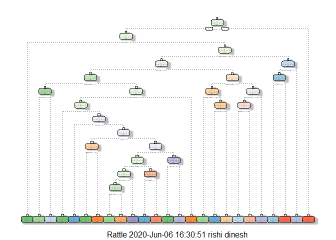
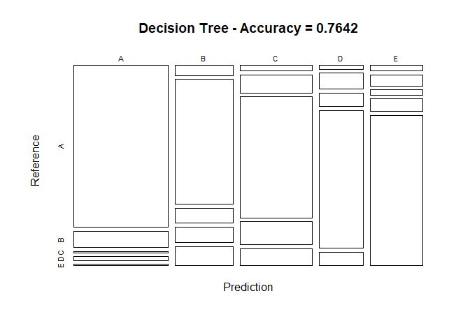
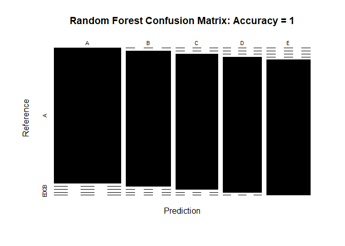

Practical Machine Learning Project
================
Rishi Dinesh
06/06/2020

## Overview

Using devices such as Jawbone Up, Nike FuelBand, and Fitbit it is now
possible to collect a large amount of data about personal activity
relatively inexpensively. These type of devices are part of the
quantified self movement – a group of enthusiasts who take measurements
about themselves regularly to improve their health, to find patterns in
their behavior, or because they are tech geeks. One thing that people
regularly do is quantify how much of a particular activity they do, but
they rarely quantify how well they do it.

This project uses data from accelerometers on the belt, forearm, arm,
and dumbell of 6 participants. They were asked to perform barbell lifts
correctly and incorrectly in 5 different ways. The goal of this project
is to predict the manner in which they did the exercise. This is the
“classe” variable in the training set.

The dataset used in this project is a courtesy of “Ugulino, W.;
Cardador, D.; Vega, K.; Velloso, E.; Milidiu, R.; Fuks, H. Wearable
Computing: Accelerometers’ Data Classification of Body Postures and
Movements”

## Loading required libraries

``` r
library(caret)
```

    ## Warning: package 'caret' was built under R version 3.6.3

    ## Loading required package: lattice

    ## Loading required package: ggplot2

    ## Warning: package 'ggplot2' was built under R version 3.6.3

``` r
library(rpart)
library(rpart.plot)
```

    ## Warning: package 'rpart.plot' was built under R version 3.6.3

``` r
library(rattle)
```

    ## Warning: package 'rattle' was built under R version 3.6.3

    ## Loading required package: tibble

    ## Warning: package 'tibble' was built under R version 3.6.3

    ## Loading required package: bitops

    ## Rattle: A free graphical interface for data science with R.
    ## Version 5.4.0 Copyright (c) 2006-2020 Togaware Pty Ltd.
    ## Type 'rattle()' to shake, rattle, and roll your data.

## Getting and Preprocessing the data

``` r
train<-read.csv("train.csv")
validate<-read.csv("test.csv")
dim(train)
```

    ## [1] 19622   160

``` r
dim(validate)
```

    ## [1]  20 160

### Cleaning the data

We first remove the variables that contain missing values

``` r
trainData<- train[, colSums(is.na(train)) == 0]
validData <- validate[, colSums(is.na(validate)) == 0]
dim(trainData)
```

    ## [1] 19622    93

``` r
dim(validData)
```

    ## [1] 20 60

We will also remove the first seven variables as they have very little
impact on the outcome variable

``` r
trainData <- trainData[, -c(1:7)]
validData <- validData[, -c(1:7)]
dim(trainData)
```

    ## [1] 19622    86

``` r
dim(validData)
```

    ## [1] 20 53

### Preparing datasets for prediction

We further split the training dataset into train and test data (70-30
split) for prediction.

``` r
set.seed(1234) 
inTrain <- createDataPartition(trainData$classe, p = 0.7, list = FALSE)
trainData <- trainData[inTrain, ]
testData <- trainData[-inTrain, ]
dim(trainData)
```

    ## [1] 13737    86

``` r
dim(testData)
```

    ## [1] 4123   86

We further clean the dataset by removing variables that have near zero
variance

``` r
NZV <- nearZeroVar(trainData)
trainData <- trainData[, -NZV]
testData  <- testData[, -NZV]
dim(trainData)
```

    ## [1] 13737    53

``` r
dim(testData)
```

    ## [1] 4123   53

We are now finally down to 53 variables.

We will now build a correlation matrix between the variables. We will
then use the findCorrelation function to search for highly correlated
attributes with a cut off equal to 0.75

``` r
cor_mat <- cor(trainData[, -53])
highlyCorrelated = findCorrelation(cor_mat, cutoff=0.75)
names(trainData)[highlyCorrelated]
```

    ##  [1] "accel_belt_z"      "roll_belt"         "accel_belt_y"     
    ##  [4] "total_accel_belt"  "accel_dumbbell_z"  "accel_belt_x"     
    ##  [7] "pitch_belt"        "magnet_dumbbell_x" "accel_dumbbell_y" 
    ## [10] "magnet_dumbbell_y" "accel_dumbbell_x"  "accel_arm_x"      
    ## [13] "accel_arm_z"       "magnet_arm_y"      "magnet_belt_z"    
    ## [16] "accel_forearm_y"   "gyros_forearm_y"   "gyros_dumbbell_x" 
    ## [19] "gyros_dumbbell_z"  "gyros_arm_x"

## Model building

For this project, we will use two different algorithms, classification
tree and random forest to predict the outcome.

### Classification trees

We will first build the model for a classification tree

``` r
set.seed(12345)
mod1<- rpart(classe ~ ., data=trainData, method="class")
fancyRpartPlot(mod1)
```

    ## Warning: labs do not fit even at cex 0.15, there may be some overplotting

<!-- -->

We will then determine the accuracy of the model by running it on the
test data.

``` r
predict1 <- predict(mod1, testData, type = "class")
cmtree <- confusionMatrix(predict1, testData$classe)
cmtree
```

    ## Confusion Matrix and Statistics
    ## 
    ##           Reference
    ## Prediction    A    B    C    D    E
    ##          A 1067  105    9   24    9
    ##          B   40  502   59   63   77
    ##          C   28   90  611  116   86
    ##          D   11   49   41  423   41
    ##          E   19   41   18   46  548
    ## 
    ## Overall Statistics
    ##                                          
    ##                Accuracy : 0.7642         
    ##                  95% CI : (0.751, 0.7771)
    ##     No Information Rate : 0.2826         
    ##     P-Value [Acc > NIR] : < 2.2e-16      
    ##                                          
    ##                   Kappa : 0.7015         
    ##                                          
    ##  Mcnemar's Test P-Value : < 2.2e-16      
    ## 
    ## Statistics by Class:
    ## 
    ##                      Class: A Class: B Class: C Class: D Class: E
    ## Sensitivity            0.9159   0.6379   0.8279   0.6295   0.7201
    ## Specificity            0.9503   0.9284   0.9055   0.9589   0.9631
    ## Pos Pred Value         0.8789   0.6775   0.6563   0.7487   0.8155
    ## Neg Pred Value         0.9663   0.9157   0.9602   0.9300   0.9383
    ## Prevalence             0.2826   0.1909   0.1790   0.1630   0.1846
    ## Detection Rate         0.2588   0.1218   0.1482   0.1026   0.1329
    ## Detection Prevalence   0.2944   0.1797   0.2258   0.1370   0.1630
    ## Balanced Accuracy      0.9331   0.7831   0.8667   0.7942   0.8416

``` r
round(cmtree$overall['Accuracy'], 4)
```

    ## Accuracy 
    ##   0.7642

We see that the **accuracy rate of the model is low (\~76%)** and
therefore the **out-of-sample-error is about 0.24** which is
considerable.

### Random forest

Again, we will start by building the model for random forest

``` r
trControl <- trainControl(method="cv", number=5)
mod2 <- train(classe~., data=trainData, method="rf", trControl=trControl, verbose=FALSE,ntree=10)
mod2$finalModel
```

    ## 
    ## Call:
    ##  randomForest(x = x, y = y, ntree = 10, mtry = param$mtry, verbose = FALSE) 
    ##                Type of random forest: classification
    ##                      Number of trees: 10
    ## No. of variables tried at each split: 27
    ## 
    ##         OOB estimate of  error rate: 3.43%
    ## Confusion matrix:
    ##      A    B    C    D    E class.error
    ## A 3817   31    8    7    4  0.01292992
    ## B   65 2497   33   19   12  0.04912414
    ## C   10   60 2259   40    4  0.04804046
    ## D    7   25   53 2136   10  0.04258180
    ## E    9   29   20   21 2424  0.03156213

We will then determine the accuracy of the model by running it on the
test data.

``` r
predict2 <- predict(mod2, newdata=testData)
cmrf <- confusionMatrix(predict2, testData$classe)
cmrf
```

    ## Confusion Matrix and Statistics
    ## 
    ##           Reference
    ## Prediction    A    B    C    D    E
    ##          A 1165    0    0    0    0
    ##          B    0  787    0    0    0
    ##          C    0    0  738    0    0
    ##          D    0    0    0  672    0
    ##          E    0    0    0    0  761
    ## 
    ## Overall Statistics
    ##                                      
    ##                Accuracy : 1          
    ##                  95% CI : (0.9991, 1)
    ##     No Information Rate : 0.2826     
    ##     P-Value [Acc > NIR] : < 2.2e-16  
    ##                                      
    ##                   Kappa : 1          
    ##                                      
    ##  Mcnemar's Test P-Value : NA         
    ## 
    ## Statistics by Class:
    ## 
    ##                      Class: A Class: B Class: C Class: D Class: E
    ## Sensitivity            1.0000   1.0000    1.000    1.000   1.0000
    ## Specificity            1.0000   1.0000    1.000    1.000   1.0000
    ## Pos Pred Value         1.0000   1.0000    1.000    1.000   1.0000
    ## Neg Pred Value         1.0000   1.0000    1.000    1.000   1.0000
    ## Prevalence             0.2826   0.1909    0.179    0.163   0.1846
    ## Detection Rate         0.2826   0.1909    0.179    0.163   0.1846
    ## Detection Prevalence   0.2826   0.1909    0.179    0.163   0.1846
    ## Balanced Accuracy      1.0000   1.0000    1.000    1.000   1.0000

``` r
round(cmrf$overall['Accuracy'], 4)
```

    ## Accuracy 
    ##        1

The **accuracy rate using the random forest is very high** and therefore
the **out-of-sample-error is equal to 0.**

### Plotting the confusion matrices

Let us plot the confusion matrices of the above two models to get a
better understanding before fitting the validation data on the best
model.

``` r
plot(cmtree$table, col = cmtree$byClass, 
     main = paste("Decision Tree - Accuracy =", round(cmtree$overall['Accuracy'], 4)))
```

<!-- -->

``` r
plot(cmrf$table, col = cmrf$byClass, main = paste("Random Forest Confusion Matrix: Accuracy =", round(cmrf$overall['Accuracy'], 4)))
```

<!-- -->

## Applying the best model to the validation data

By comparing the accuracy rate values of the two models, it is clear the
the ‘Random Forest’ model is the winner. So will use it on the
validation data

``` r
Results <- predict(mod2, newdata=validData)
Results
```

    ##  [1] B A B A A E D B A A B C B A E E A B B B
    ## Levels: A B C D E
